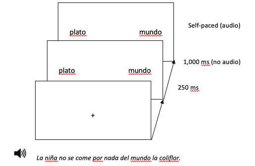
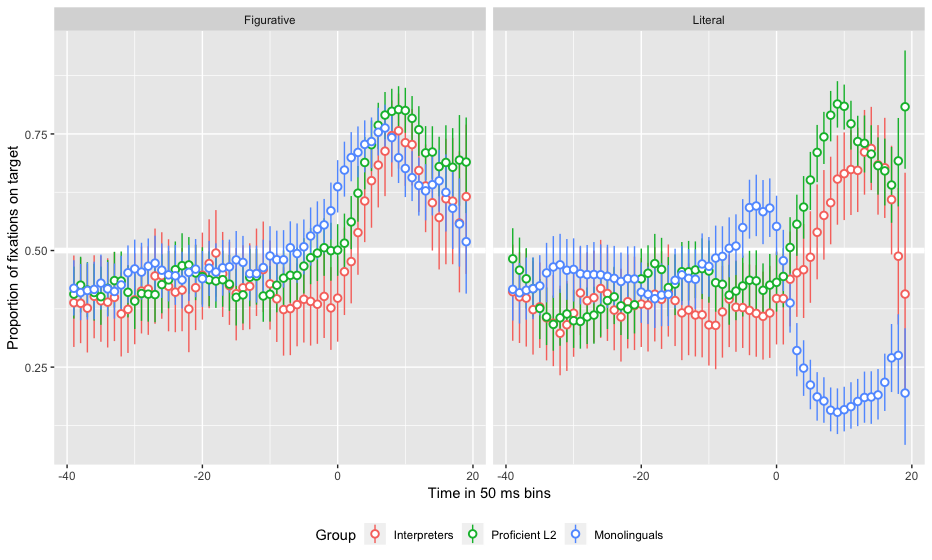
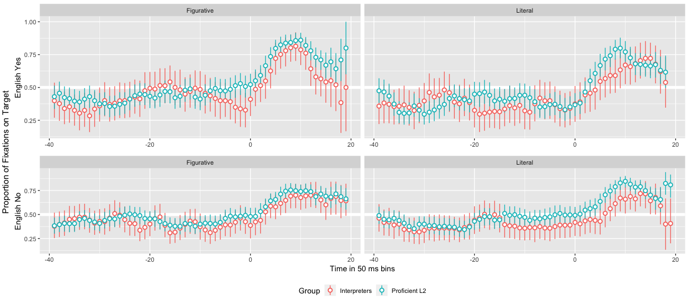

# 1. Introduction

### .center[To be left high and dry   
The grass is always greener on the other side]

--

Even proficient L2 speakers have problems (Hill, 1999; Littlemore et al., 2011)   
- Inefficient processing (Kim & Nam, 2017)
- Use of different processing strategies (Littlemore & Low, 2006) 
- Storage?

???

Mention Pollio et al.'s (1987)
English sources 3k novel metaphors + 7k idioms/week

---

# 1. Introduction

## Constraint-Based Model (Libben & Titone, 2008)

Figurative language processed as literal language, but:
1. very familiar idioms are stored as units. 
2. the figurative interpretation of an idiom can be activated before the expression has reached its end. 
3. the compositional and non-compositional meanings of the string may interact. 

---

# 1. Introduction

## Literal Saliency Hypothesis (Cieślicka, 2006)

- Conventionality
- Frequency
- Prototypicality
- Familiarity

(Huang, 2009)
 
--
 
 
- For cross-linguistic transfer (Carroll et al., 2016, Heredia & Cieślicka, 2014, Williams & Cheung, 2011)    
- Against cross-linguistic transfer (Kellerman, 1986, Wolter & Yamashita, 2015)  
- In between (Boers, 2003, Bulut & Çelik-Yazici, 2004, Charteris-Black, 2002, Laufer, 2000, Liontas, 2001) 

---

# 1. Introduction

## Semantic anticipation

- Gender (Huettig & Janse, 2016)
- Tense (Altmann & Kamide, 2007)
- Stereotypical constraints (Kamide, Altmann & Haywood, 2003)
- Nouns based on frequent context (DeLong, Urbach and Kutas, 2005; Nieuwland et al., 2017)

---

# 1. Introduction

## Interpreters

- Better at detecting erros in written contexts (Yudes et al., 2013)   
- Improved reading comprehension (Bajo et al., 2000)   
- Superior semantic processing abilities (García, 2014) 

---

# 2. My study

### Can L1 and L2 speakers of Spanish (proficient speakers and interpreters) predict figurative language based on the first lexical item of the expression?

--

 
.center[
Por _nada_ del __mundo__
]

 
--

- L1 speakers and interpreters anticipate figurative expressions but not literal.
- Proficient L2 speakers cannot use the first content word as key element to anticipate.

If speakers can anticipate it, the collocation stored as multi-word unit.
Anticipation experience helps in processing figurative language efficiently.

---

# 2. My study

### For L2 speakers, do they anticipate faster collocations with equivalents in their L1?

 

- Interpreters will anticipate alike both conditions.
- Proficient L2 speakers will not anticipate differently both conditions.

 

No cross-linguistic transfer due to idiosyncrasies.

---

# 3. Methods

## Participants

- 32 L1 Spanish
- 31 L1 English, advanced L2 Spanish
- 13 L1 English, L2 Spanish interpreters

???

to indent -> &nbsp;&nbsp;&nbsp;&nbsp;&nbsp;&nbsp;
to move add one line ->  
---

# 3. Methods

## Materials

16 collocations + 16 versiones literales    
Frequency: CREA
 
 

|  | Figurative | Literal |
|:---|:---|:---|  
|  |   |    
| Exists in English | por nada del mundo | por nada del plato |   
|  |   |    
| Does not exist in English | con conocimiento de causa | con conocimiento de sanción |   

---

# 3. Methods

## Procedure

### Norming Phase 
(Molinaro & Carreiras, 2010; Cacciari & Corradini, 2015)

--

### Experimental Phase

- DELE
- Sociolinguistic background
- Eye-tracking task
- Phonetic short-term memory task
- Collocation recognition tasks

---

# 3. Methods

### Eye-tracking sample trial

Audio: _La niña no se come por nada del mundo la colifor._

???

200 ms shift

<audio controls>
  <source src="./libs/FO1_C1.wav" type="audio/wav">
  <embed src="./libs/FO1_C1.wav" autostart="false" hidden="true" />
</audio>

---

# 4. Results

Group anticipation comparison by figurativeness

???

Alpha level = 0.005
---

# 4. Results

L2 speakers' anticipation in figurative and literal trials comparing expressions with and without equivalent versions in English

---

# 4. Results

- Monolinguals: Fixate on target above chance at target onset but not at cue offset in both figurative and literal trials.   
- L2 speakers: Do not fixate on target above chance either at cue offset or target onset in either condition.

--
 
 
 
 

Main effect: Group

&nbsp;&nbsp;&nbsp;&nbsp;&nbsp;&nbsp;&nbsp;χ2(1) = 12.77, p < 0.001

---

# 5. Discussion

Monolinguals anticipate > expressions as multi-word units

&nbsp;&nbsp;&nbsp;&nbsp;&nbsp;&nbsp;&nbsp;- Lexical elements as cues    
&nbsp;&nbsp;&nbsp;&nbsp;&nbsp;&nbsp;&nbsp;- Delayed figurative activation (Boulenger et al., 2012)     
&nbsp;&nbsp;&nbsp;&nbsp;&nbsp;&nbsp;&nbsp;- Figurative interpretation activated even in literal contexts     
&nbsp;&nbsp;&nbsp;&nbsp;&nbsp;&nbsp;&nbsp;- Literal uses anticipated through prosody     
&nbsp;&nbsp;&nbsp;&nbsp;&nbsp;&nbsp;&nbsp;- Constraint-Based Model

--

L2 speakers do not anticipate > individual word storage

&nbsp;&nbsp;&nbsp;&nbsp;&nbsp;&nbsp;&nbsp;- Combined to match context     
&nbsp;&nbsp;&nbsp;&nbsp;&nbsp;&nbsp;&nbsp;- No cross-linguistic transfer    
&nbsp;&nbsp;&nbsp;&nbsp;&nbsp;&nbsp;&nbsp;- Anticipation experience do not help in figurative language processing    
&nbsp;&nbsp;&nbsp;&nbsp;&nbsp;&nbsp;&nbsp;- Literal Saliency Hypothesis (partially)

---

# 6. Conclusion

- Lagging L2 figurative language performance may stem from storage.     
- Should we teach figurative expressions differently?

---

 
 
 
 
 
 

.center[
# Thank you
]

