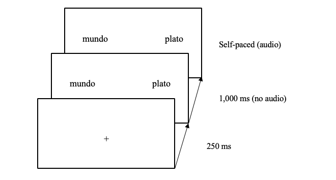

# 1. Introduction

### .center[To be left high and dry   
The grass is always greener on the other side]

--

Even proficient L2 speakers have problems (Hill, 1999; Littlemore et al., 2011)   
- Inefficient processing (Kim & Nam, 2017)
- Use of different processing strategies (Littlemore & Low, 2006) 
- Storage?

???

Mention Pollio et al.'s (1987) study

---

# 1. Introduction

## Constraint-Based Model (Libben & Titone, 2008)

Figurative language processed as literal language, but:
1. very familiar idioms are stored as units. 
2. the figurative interpretation of an idiom can be activated before the expression has reached its end. 
3. the compositional and non-compositional meanings of the string may interact. 

---

# 1. Introduction

## Literal Saliency Hypothesis

- Conventionality
- Frequency
- Prototypicality
- Familiarity

(Huang, 2009)
 
--
 
 
- For cross-linguistic transfer (Carroll et al., 2016, Heredia & Cieślicka, 2014, Williams & Cheung, 2011)    
- Against cross-linguistic transfer (Kellerman, 1986, Wolter & Yamashita, 2015)  
- In between (Boers, 2003, Bulut & Çelik-Yazici, 2004, Charteris-Black, 2002, Laufer, 2000, Liontas, 2001) 

---

# 1. Introduction

## Semantic anticipation

- Gender (Huettig & Janse, 2016)
- Tense (Altmann & Kamide, 2007)
- Stereotypical constraints (Kamide, Altmann & Haywood, 2003)
- Nouns based on frequent context (DeLong, Urbach and Kutas, 2005; Nieuwland et al., 2017)

---

# 2. My study

### Can L1 and L2 speakers predict figurative language based on the first lexical item of the expression?

--

 
.center[
Por _nada_ del __mundo__
]

 
--

- L1 and interpreters anticipate figurative expressions but not literal.
- L2 cannot use the first content word as key element to anticipate.

If they can anticipate it, the collocation stored as multi-word unit.

---

# 2. My study

### For L2 speakers, do they anticipate faster collocations with equivalents in their L1?

 

- Advanced L2 speakers will not anticipate differently both conditions.

 

No cross-linguistic transfer.

---

    What are my independent variables?

--

&nbsp;&nbsp;&nbsp;&nbsp;&nbsp;&nbsp;Group

--
 

|  | Figurative | Literal |
|:---|:---|:---|  
|  |   |    
| Exists in English | por nada del mundo | por nada del plato |   
|  |   |    
| Does not exist in English | con conocimiento de causa | con conocimiento de sanción |   

---

# 3. Methods

## Participants

- 32 L1 Spanish
- 31 L1 English, advanced L2 Spanish

--

## Materials

16 collocations + 16 versiones literales

.small[Frequency: CREA]

---

# 3. Methods

## Procedure

### Norming Phase 
(Molinaro & Carreiras, 2010; Cacciari & Corradini, 2015)

--

### Experimental Phase

- DELE
- Sociolinguistic background
- Eye-tracking task
- Working memory task
- Phonetic short-term memory task
- Collocation recognition tasks

---

# 3. Methods

### Eye-tracking sample trial

 
 

---

    What might the dependent variable be?

--

    Proportion of fixations on target
 
 

--

.center[Questions, concerns, suggestions about experimental design?]

---
# 4. Analysis

    What would you run:
    
      - To calculate whether speakers anticipate or not:

--

          One-tailed t-tests

--

      - To evaluate the influence of each independent variable on the capacity
      to anticipate figurative language:

--

          GLMM

---

# 4. Analysis

    Your turn:

      - Calculate whether L2 speakers anticipated expressions with equivalent 
      versions in English in figurative trials.
      - Calculate homogeneity.
      - Calculate any differences in anticipation between groups for 
      figurative trials in general.

--
    How to:
    
      1. Convert categorical predictors to numerical predictors.
      2. Select cases.
      3. One-sample t test > Test value = 50
      
      I. Select cases.
      II. Compare means > Independent samples t test
      III. Compare t observed with t critical (hypothesis: mon anticipate > L2)

---

# 5. Results

### Anticipation of L2 speakers in figurative trials when similar expressions exist in English

--

H0: There will be no differences
t observed: _t_(123) = -1109.94, _p_ = .000
t critical: 1.980

Since t ovserved is smaller than t critical, we cannot reject H0 (no anticipation), and therefore we can conclude that bilingual speakers do not anticipate figuratve collocations that have equivalent expressions in English.

---

# 5. Results

### Differences between groups in figurative trials

--

HA: Monolingual speakers anticipate more than L2 speakers
Levene p = .045 > equal variances not assumed
t observed: _t_(500.947) = 2.462, _p_ = .014
t critical: 1.645

We can reject H0 (no differences) and conclude that monolingual speakers anticipate more than advanced L2 speakers.

---

# 5. Results

Group anticipation comparison by figurativeness

---

# 5. Results

L2 speakers' anticipation in figurative and literal trials comparing expressions with and without equivalent versions in English

---

# 6. Discussion

Monolinguals anticipate > expressions as multi-word units

&nbsp;&nbsp;&nbsp;&nbsp;&nbsp;&nbsp;&nbsp;Lexical elements as cues    
&nbsp;&nbsp;&nbsp;&nbsp;&nbsp;&nbsp;&nbsp;Delayed figurative activation   
&nbsp;&nbsp;&nbsp;&nbsp;&nbsp;&nbsp;&nbsp;Constraint-Based Model

--

L2 speakers do not anticipate > individual word storage

&nbsp;&nbsp;&nbsp;&nbsp;&nbsp;&nbsp;&nbsp;Combined to match context     
&nbsp;&nbsp;&nbsp;&nbsp;&nbsp;&nbsp;&nbsp;No cross-linguistic transfer  
&nbsp;&nbsp;&nbsp;&nbsp;&nbsp;&nbsp;&nbsp;Literal Saliency Hypothesis

---

# 7. Conclusion

Lagging L2 figurative language performance may stem from storage.

---

 
 
 
 
 
 

.center[
# Thank you
]

